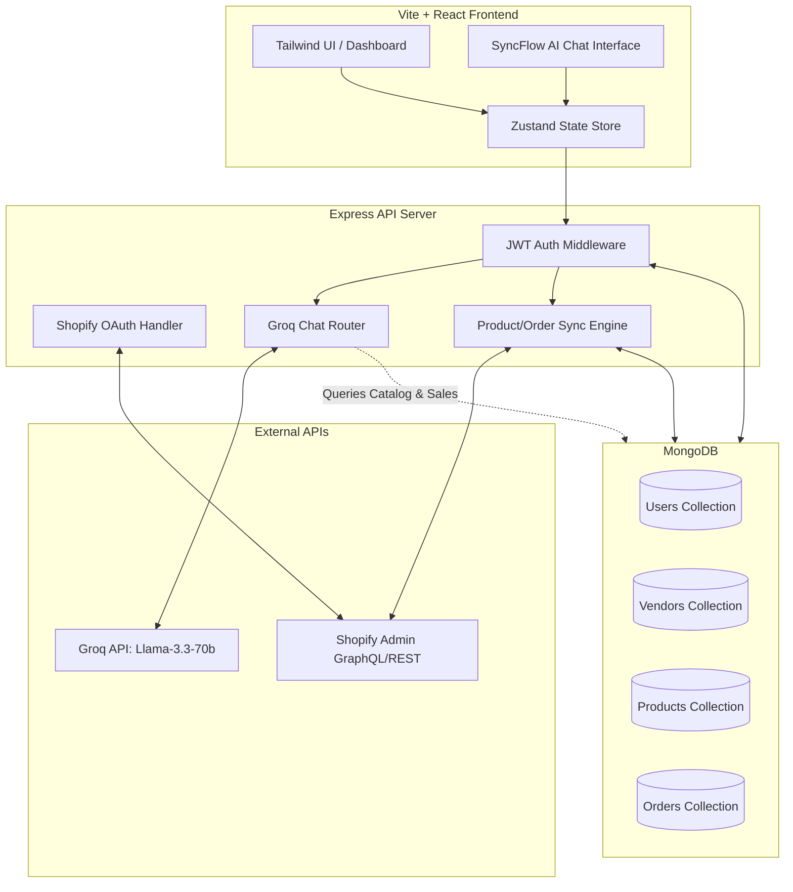

# ⚡ SyncFlow AI

> Next-generation AI-powered multi-vendor marketplace platform for Shopify stores. Streamline onboarding, automate product/order syncing, and manage your operations with a natural language AI assistant.

[](https://tailwindcss.com)
[](https://react.dev)
[](https://vite.dev)
[](https://expressjs.com)
[](https://mongodb.com)
[](https://groq.com)

---

## 📖 Table of Contents

- [✨ Features](#-features)
- [🏗️ System Architecture](#️-system-architecture)
- [💻 Tech Stack](#-tech-stack)
- [📂 Project Structure](#-project-structure)
- [🚀 Getting Started](#-getting-started)
  - [Prerequisites](#prerequisites)
  - [1. Clone \& Environment Configuration](#1-clone--environment-configuration)
  - [2. Backend Setup \& Seeding](#2-backend-setup--seeding)
  - [3. Frontend Setup](#3-frontend-setup)
- [🔐 Environment Variables](#-environment-variables)
- [🛒 Shopify Integration Details](#-shopify-integration-details)
- [🤖 AI Assistant Grounding](#-ai-assistant-grounding)
- [🔌 API Endpoints Reference](#-api-endpoints-reference)
- [📜 License](#-license)

---

## ✨ Features

*   🤖 **AI-Powered Store Assistant:** Native dashboard chatbot integrated with Llama 3.3 (via Groq API). Instantly query real-time store metrics (revenue in ₹), product catalog details, stock alerts (low-stock warning if `< 10`), and vendor approvals.
*   🔌 **Multi-Merchant Shopify OAuth:** Secure authentication handshake using official Shopify OAuth, supporting scoped access (`read_products`, `read_orders`, `write_inventory`, etc.).
*   👥 **Multi-Vendor Management:** Onboard, review, and approve individual or company-based vendors. Track performance stats like fulfillment rate and total generated revenue.
*   📦 **Real-Time Inventory & Product Sync:** Bi-directional tracking of products, variants, SKUs, inventory amounts, and synchronization statuses (`synced`, `pending`, `error`).
*   📊 **Analytics Dashboard:** Responsive, interactive charting (using Recharts) for revenue trend tracking, order status breakdown, top vendors, and inventory status list.
*   🛡️ **Enterprise-Grade Security:** Backend powered by JWT authentication, secure cookies, helmet protection, CORS control, and automated rate-limiting.

---

## 🏗️ System Architecture

The following diagram illustrates how the components of **SyncFlow AI** communicate with external APIs (Shopify and Groq) and the MongoDB database:



---

## 💻 Tech Stack

### Frontend
- **React (v19)** — Library for UI development.
- **Vite (v8)** — Extremely fast build tool and dev server.
- **Tailwind CSS (v4)** — Styling utility framework.
- **React Router Dom (v7)** — Routing & navigation.
- **Zustand** — Minimal, fast state management.
- **Recharts** — Beautiful responsive charting.
- **Lucide React** — Premium icon library.
- **Framer Motion** — Micro-interactions and animations.

### Backend
- **Node.js** & **Express (v5)** — Fast backend service.
- **MongoDB** & **Mongoose (v8)** — Schema definition & document queries.
- **JSON Web Tokens (JWT)** & **Bcryptjs** — User security and sessions.
- **Groq Node SDK / Fetch API** — Fast LLM inferencing.
- **Helmet** & **Express Rate Limit** — Server hardening.

---

## 📂 Project Structure

```text
syncflow-ai/
├── src/                      # Frontend Application
│   ├── app/                  # Main App routing configuration
│   ├── components/           # Reusable generic UI components
│   ├── features/             # Feature-based code modules
│   │   ├── analytics/        # Recharts dashboard tracking
│   │   ├── auth/             # Login, signup, user context
│   │   ├── chat/             # SyncFlow AI chatbot UI
│   │   ├── dashboard/        # Main landing dashboard
│   │   ├── landing/          # Public marketing page
│   │   ├── orders/           # Order table and details
│   │   ├── products/         # Product lists and sync states
│   │   ├── settings/         # Profile and integrations config
│   │   ├── shopify/          # Shopify store connector settings
│   │   └── vendors/          # Vendor approval & management
│   ├── hooks/                # Custom React hook helpers
│   ├── lib/                  # Configurations (Axios client, etc.)
│   ├── store/                # Global state stores (Zustand)
│   ├── styles/               # Main CSS styles
│   ├── index.html            # Main HTML wrapper
│   └── main.jsx              # App startup entry point
├── server/                   # Backend Application
│   ├── config/               # Database and configuration setup
│   ├── middleware/           # Auth and error middleware
│   ├── models/               # Mongoose MongoDB schemas
│   │   ├── User.js           # Marketplace owners / managers
│   │   ├── Vendor.js         # Multi-vendor merchant profiles
│   │   ├── Product.js        # Synced products & stock
│   │   ├── Order.js          # Unified order logs
│   │   └── ShopifyStore.js   # OAuth connection tokens
│   ├── routes/               # API Router Handlers
│   │   ├── auth.js           # Authentication routes
│   │   ├── chat.js           # Groq-powered grounded chatbot
│   │   ├── orders.js         # Orders tracking
│   │   ├── products.js       # Products tracking
│   │   ├── vendors.js        # Vendor workflow states
│   │   ├── shopify.js        # Shopify webhook & inventory sync
│   │   └── shopifyAuth.js    # Shopify OAuth handshake handlers
│   ├── seed.js               # Dummy data seeding script
│   └── index.js              # Express main entry server
└── package.json              # Client scripts & dependencies
```

---

## 🚀 Getting Started

### Prerequisites
- **Node.js** (v18.x or v20.x recommended)
- **MongoDB** (Local instance running at `mongodb://localhost:27017` or MongoDB Atlas URI)
- **Groq API Key** (Get one at [console.groq.com](https://console.groq.com))

---

### 1. Clone & Environment Configuration

Copy the sample environment variables for the server:

```bash
# In the project workspace, inspect and edit the server environment file
cd syncflow-ai/server
cp .env.example .env  # Or create server/.env manually based on instructions below
```

---

### 2. Backend Setup & Seeding

Install the dependencies, seed the database with mock vendors/products/orders, and launch the server:

```bash
cd syncflow-ai/server
npm install

# Seed the database (creates mock data + demo user account)
node seed.js

# Launch the backend server (starts on http://localhost:5000)
npm run dev
```

On success, you will see:
```text
Connected to MongoDB
Cleared existing data
Created user: demo@syncflow.ai (password: password123)
Created 6 vendors
Created 10 products
Created 20 orders

✅ Seed complete!
   Login: demo@syncflow.ai / password123
```

---

### 3. Frontend Setup

Open a new terminal window to run the Vite development server:

```bash
cd syncflow-ai
npm install
npm run dev
```

Open your browser and navigate to: **[http://localhost:5173](http://localhost:5173)**

*   **Username:** `demo@syncflow.ai`
*   **Password:** `password123`

---

## 🔐 Environment Variables

The backend relies on the following environment keys inside `server/.env`:

| Key | Description | Default |
| :--- | :--- | :--- |
| `PORT` | Listening port of Express server | `5000` |
| `MONGODB_URI` | Connection URI for MongoDB database | `mongodb://localhost:27017/syncflow-ai` |
| `JWT_SECRET` | Secret token used to sign/verify JWT tokens | `syncflow-ai-super-secret-jwt-key` |
| `JWT_EXPIRES_IN` | Lifespan of the session token | `7d` |
| `CORS_ORIGIN` | Allowed Client CORS host address | `http://localhost:5173` |
| `NODE_ENV` | Running node environment mode | `development` |
| `groq_api_key` | API authorization key for Groq LLM queries | *(Required)* |
| `SHOPIFY_API_KEY` | Shopify API App client key | *(Optional for OAuth)* |
| `SHOPIFY_API_SECRET` | Shopify API App secret token | *(Optional for OAuth)* |
| `SHOPIFY_APP_URL` | Public server domain (webhook/OAuth redirect) | `https://your-backend-domain.com` |
| `FRONTEND_URL` | Post-OAuth redirect client page | `https://your-frontend-domain.com` |
| `SHOPIFY_SCOPES` | Allowed store scopes requested from Shopify | `read_products,write_products,read_orders...` |

---

## 🛒 Shopify Integration Details

SyncFlow AI provides standard OAuth endpoints to integrate multi-merchant shops. When a vendor attempts to connect their store:

1.  **Authorization Request:** The backend routes the store owner to `/api/shopify-auth/offline/auth?shop=STORE_NAME.myshopify.com`.
2.  **Handshake:** Shopify prompts the user to grant the scopes specified in `SHOPIFY_SCOPES`.
3.  **Token Exchange:** Shopify redirects the client back to `/api/shopify-auth/offline/callback`. The backend retrieves the offline access token and saves it under the corresponding `ShopifyStore` model.
4.  **Sync Engine:** SyncFlow pulls products, variants, and stock counts into the `Product` collection and registers webhooks for order creation and updates.

---

## 🤖 AI Assistant Grounding

The chat service uses **Grounded Retrieval-Augmented Generation (RAG)** to provide accurate store statistics. When you ask a query:

1.  The backend routes requests to `POST /api/chat`.
2.  It aggregates:
    *   Full active product catalogs (SKUs, category, price, stock quantity, sync status).
    *   All vendor credentials & status updates.
    *   Aggregate store orders counts and overall revenue metric summaries.
3.  It constructs an explicit system prompt embedding this catalog, forcing the LLM to format prices in `₹` (Indian Rupees) and warning about low stock (inventory `< 10`).
4.  The grounded system prompt and conversation history are dispatched to Groq's Llama 3.3 endpoint.

---

## 🔌 API Endpoints Reference

### 🔐 Authentication (`/api/auth`)
*   `POST /api/auth/register` — Create new marketplace admin/manager.
*   `POST /api/auth/login` — Sign in and get HTTP-only cookie + payload.
*   `POST /api/auth/logout` — Revoke and clean cookies.
*   `GET /api/auth/me` — Verify current user session details.

### 👥 Vendors (`/api/vendors`)
*   `GET /api/vendors` — List all vendors.
*   `POST /api/vendors` — Apply as a new vendor.
*   `PATCH /api/vendors/:id/status` — Approve or reject vendor registration.

### 📦 Products (`/api/products`)
*   `GET /api/products` — Retrieve unified vendor products catalogue.
*   `POST /api/products` — Create a local custom vendor product.

### 🛒 Orders (`/api/orders`)
*   `GET /api/orders` — List unified vendor orders.
*   `GET /api/orders/stats` — Retrieve summary analytics (gross revenue, order counts, status rates).

### 🤖 Chat (`/api/chat`)
*   `POST /api/chat` — Start/continue a conversation with the grounded SyncFlow assistant.

---

## 📜 License

Distributed under the ISC License. See `LICENSE` for more information.
